# 👋 Hi, I'm Aditya Tomar

### Building cool things and breaking them to learn why.

  
  
  

---

## 👨‍💻 About Me

- 🔭 Currently working on **different projects**
- 🌱 Currently learning **AI, full-stack development & content creation**
- 🤝 Open to collaborating on **interesting projects and ideas**
- 💬 Ask me about **Full-Stack Development**
- 📫 Reach me at **[adityatomar54123@gmail.com](mailto:adityatomar54123@gmail.com)**
- ⚡ Fun fact: **I run a gaming channel with 100K+ subscribers**

> Building, experimenting, breaking things, fixing them, and learning something new every day. 🚀

---

## 🛠️ Tech Stack

  

  
  

---

# 📊 GitHub Analytics

  <picture>
    <source media="(prefers-color-scheme: dark)" srcset="./assets/overview.dark.svg">
    
  </picture>

## 💻 Activity Graph

  <picture>
    <source media="(prefers-color-scheme: dark)" srcset="https://raw.githubusercontent.com/cineadi/cineadi/output/activity-graph-dark.svg">
    <source media="(prefers-color-scheme: light)" srcset="https://raw.githubusercontent.com/cineadi/cineadi/output/activity-graph-light.svg">
    
  </picture>

---

# 💻 Language Statistics

  <picture>
    <source media="(prefers-color-scheme: dark)" srcset="./assets/languages.dark.svg">
    
  </picture>

---

# ⭐ Featured Projects

<!-- Add your real projects here when you have them.

-->

---

---

# 🤝 Connect With Me

---

### 🚀 Build. Break. Learn. Repeat.

